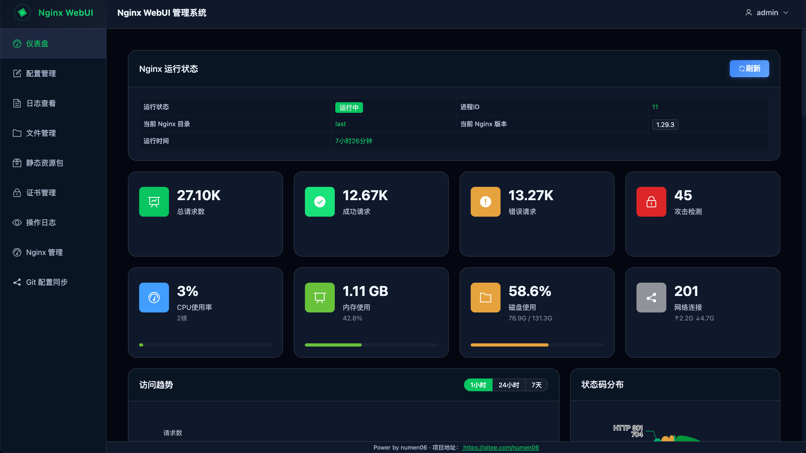
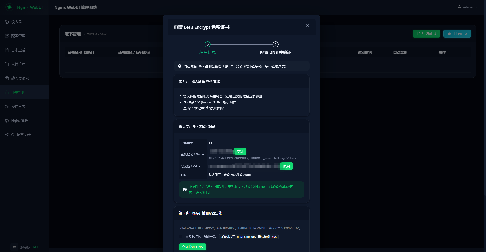

# Nginx WebUI

一个基于 **FastAPI** 和 **Vue 3** 的 Nginx 管理 Web 界面，提供 Nginx 多版本管理、配置管理、证书管理、文件管理、静态包下发、日志与审计、系统监控等功能。




## 功能特性

- **Nginx 管理**
  - ✅ Nginx 配置在线编辑、测试、重载
  - ✅ 多版本 Nginx 管理（下载、编译、切换版本）
  - ✅ 配置备份与恢复（保留最近多份备份）
- **配置与文件**
  - ✅ 全局配置管理（应用配置、Nginx 路径等）
  - ✅ 文件管理（上传、编辑、删除 Nginx 相关文件）
  - ✅ 静态包管理（打包并下发静态资源包）
- **证书与安全**
  - ✅ 证书管理（支持 Certbot 自动签发与手动上传证书）
  - ✅ 证书导出/导入与「迁移与自动续签」向导：见 [docs/cert-migration.md](docs/cert-migration.md)
  - ✅ JWT 认证与会话管理
  - ✅ 用户管理与基础权限控制
- **日志与审计**
  - ✅ Nginx 访问日志、错误日志在线查看
  - ✅ 操作审计日志（记录关键操作轨迹）
- **系统与统计**
  - ✅ 系统信息与资源监控
  - ✅ 访问与操作统计
- **集成与部署**
  - ✅ Git 仓库同步（配置凭据后，一键推送当前 Nginx 配置）
  - ✅ Docker 容器化部署与一键打包脚本

## 技术栈

### 后端
- FastAPI
- SQLAlchemy (SQLite)
- Pydantic
- Certbot

### 前端
- Vue 3 + Composition API
- Vite
- Element Plus
- Monaco Editor

## 项目结构

```
nginx-webui/
├── backend/              # FastAPI 后端
│   ├── app/              # 应用代码（路由、模型、业务逻辑、工具等）
│   ├── config.yaml       # 后端配置文件
│   └── default-nginx/    # 内置默认 Nginx 源码/配置包
├── frontend/             # Vue 3 前端
│   └── src/              # 前端源码（视图、组件、路由、状态等）
├── data/                 # 运行时数据目录（容器/本地挂载）
│   ├── backend/          # 后端数据（如 SQLite 数据库）
│   ├── logs/             # 应用/代理日志
│   ├── backups/          # Nginx 配置备份
│   └── nginx/            # Nginx 多版本管理数据
│       ├── versions/     # 各版本 Nginx 安装目录（含 conf/html/logs/sbin）
│       ├── build/        # Nginx 源码下载与编译临时目录
│       └── build_logs/   # 各版本编译日志
├── scripts/              # 构建和启动脚本（前后端、本地/容器）
├── docker-compose.yml    # Docker 编排文件
├── Dockerfile            # 应用镜像构建文件
├── QUICKSTART.md         # 本地开发/调试快速上手指南
└── README.md
```

### 目录说明

- **backend/**：后端服务代码与配置，包含认证、用户管理、Nginx 管理、证书、日志、审计等 API
- **frontend/**：前端单页应用，包含仪表盘、Nginx 管理、配置、文件、证书、Git 同步、用户、审计、日志、静态包、系统等页面
- **data/**：存放所有运行时生成和下载的数据，包括：
  - 后端数据库等持久化数据（`backend/`）
  - 日志文件（`logs/`）
  - 配置备份（`backups/`）
  - Nginx 多版本运行数据（`nginx/versions/`）
  - Nginx 源码构建目录与编译日志（`nginx/build/`、`nginx/build_logs/`）
- **scripts/**：一键启动、重启、打包、清理等辅助脚本

## 快速开始

### 开发环境

#### 后端开发

```bash
cd backend
pip install -r requirements.txt
python3 -m uvicorn app.main:app --reload --host 127.0.0.1 --port 8000
```

或使用脚本（在项目根目录）：

```bash
bash scripts/start-backend.sh
```

#### 前端开发

```bash
cd frontend
npm install          # 首次运行需要安装依赖
npm run dev          # 默认运行在 http://localhost:3001
```

或使用脚本：

```bash
bash scripts/start-frontend.sh
```

### Docker 部署

#### 构建镜像

```bash
bash scripts/package.sh
```

#### 运行容器

```bash
docker-compose up -d
```

或使用 Docker 命令：

```bash
docker run -d \
  -p 80:80 \
  -p 443:443 \
  -p 8000:8000 \
  -v $(pwd)/nginx-webui/data:/app/data \
  --name nginx-webui \
  registry.cn-shanghai.aliyuncs.com/numen/nginx-webui:latest
```

## 配置说明

配置文件位于 `backend/config.yaml`，可以配置：

- Nginx 相关路径
- 应用端口和主机
- 备份策略
- SSL 证书路径

也可以通过环境变量覆盖配置。

## Git 配置同步

1. 登录前端，进入左侧菜单的 **Git 配置同步** 页面并填写：
   - 项目名称（决定 `data/git/<项目名称>/` 目录，默认建议为当前根目录名）
   - 仓库地址（建议 HTTPS）
   - 目标分支（默认 `main`）
   - 账号与密码（凭证只保存在后端数据库，不会回显）
2. 保存后即可点击「立即同步」，系统会：
   - 以填写的项目名称（若未填写则使用默认值）组织本地仓库
   - 将正在使用的 `nginx.conf` 导出到 `data/git/<项目名称>/` 目录
   - 自动执行 `git add/commit/push` 推送到远端
3. 同步状态（成功/失败/无变更）会显示在卡片中，并记录最近一次的时间与消息。

> 注意：首次同步会在 `data/git` 下克隆仓库，请确保容器或宿主机具备访问目标 Git 服务的网络权限。

## 默认账户

- 用户名: `admin`
- 密码: `admin`

**首次登录后请立即修改密码！**

## 许可证

MIT License

