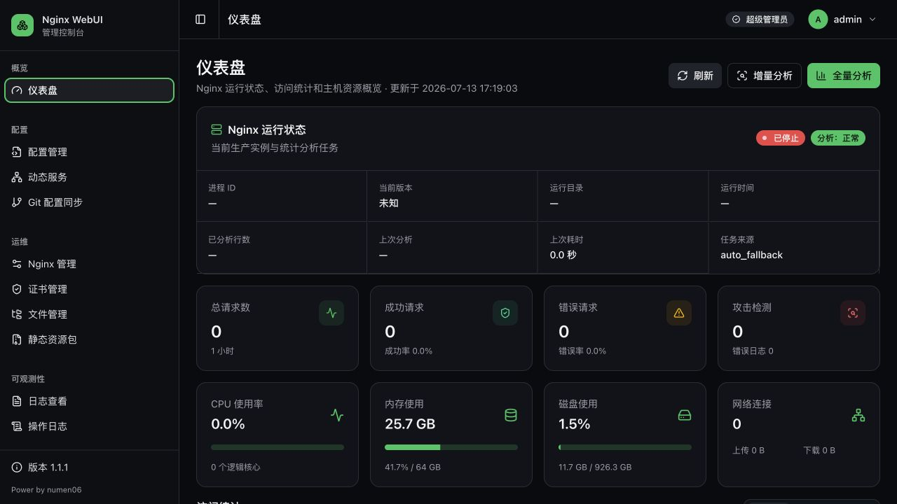
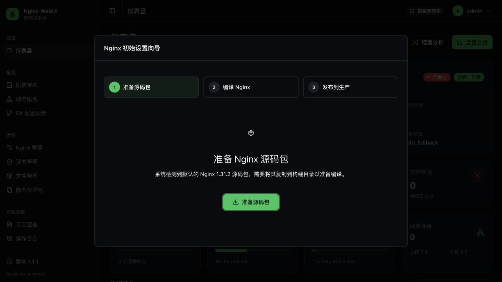
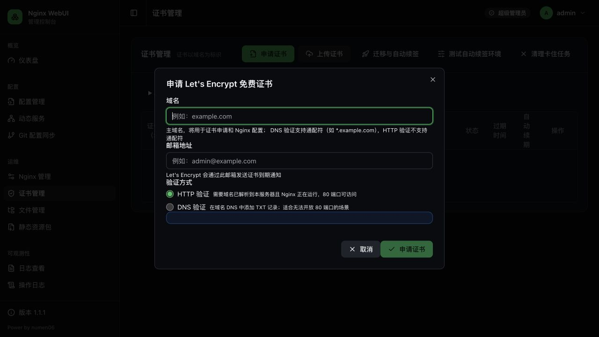

# Nginx WebUI

Nginx WebUI 是一个面向日常运维的 Nginx 管理控制台。通过浏览器即可完成 Nginx 安装与版本切换、配置编辑与重载、证书申请与续签、日志查看、文件管理、配置备份和 Git 同步。

当前版本内置 **Nginx 1.31.2** 源码包，新部署可直接通过初始化向导完成编译和发布。

## 界面预览

### 运行状态与访问统计



### 首次安装 Nginx



### 申请 Let's Encrypt 证书



## 主要用途

- **管理 Nginx**：下载、编译、切换和发布多个 Nginx 版本。
- **维护配置**：在线编辑配置，执行语法检查后安全重载，并自动保留备份。
- **管理证书**：申请 Let's Encrypt 证书、上传已有证书、迁移证书并配置自动续签。
- **查看运行情况**：集中查看访问日志、错误日志、访问趋势、状态码和主机资源。
- **管理配套文件**：上传和编辑配置文件，维护静态资源包。
- **保留操作记录**：记录关键操作审计日志，支持用户和权限管理。
- **同步配置到 Git**：将当前 Nginx 配置提交并推送到指定仓库。

## 5 分钟部署

推荐使用 Docker Compose。运行前请确认宿主机的 `80`、`443` 和 `800` 端口未被占用。

```bash
git clone https://gitee.com/numen06/nginx-webui.git
cd nginx-webui
docker compose up -d --build
```

启动后访问：

```text
http://服务器IP:800
```

查看运行状态和日志：

```bash
docker compose ps
docker compose logs -f nginx-webui
```

默认账户：

- 用户名：`admin`
- 密码：`admin`

> 首次登录后请立即进入右上角用户菜单修改默认密码。

### 直接运行镜像

不需要本地构建时，可以直接运行已发布镜像：

```bash
docker run -d \
  --name nginx-webui \
  --restart always \
  -p 800:8000 \
  -p 80:80 \
  -p 443:443 \
  -v /opt/nginx-webui/data:/app/data \
  -e APP_PORT=8000 \
  -e CERTBOT_CONFIG_DIR=/app/data/letsencrypt \
  registry.cn-shanghai.aliyuncs.com/numen/nginx-webui:latest
```

## 首次使用

### 1. 修改默认密码

使用 `admin/admin` 登录后，系统会进入用户中心。设置新密码并重新登录，避免管理端暴露默认凭据。

### 2. 安装默认 Nginx

首次部署且还没有可用 Nginx 时，系统会自动打开初始化向导：

1. 点击 **准备源码包**，将内置的 Nginx 1.31.2 源码包复制到构建目录。
2. 点击 **编译 Nginx**，等待编译完成；进度和错误信息可在界面中查看。
3. 点击 **发布到生产**，将编译结果切换为当前运行版本。
4. 返回仪表盘，确认状态变为“运行中”。

编译失败时，先查看 **Nginx 管理** 页面中的构建日志；容器内需要具备编译工具以及 PCRE、zlib、OpenSSL 开发库。仓库提供的 Docker 镜像已经包含这些依赖。

### 3. 配置站点

进入 **配置管理**：

1. 编辑主配置或站点配置。
2. 保存前执行配置测试。
3. 测试通过后重载 Nginx。
4. 如果配置异常，可从备份记录恢复上一版本。

建议每次只完成一组相关修改，并在重载后立即检查错误日志和站点访问情况。

## 常用操作

### Nginx 版本管理

进入 **Nginx 管理**，可以下载或上传源码包、编译新版本、查看构建日志以及切换生产版本。切换前建议先备份配置，并确认新版本所需模块与当前配置兼容。

### 申请免费证书

进入 **证书管理**，点击 **申请证书**：

- **HTTP 验证**：域名必须已经解析到当前服务器，公网能够访问 `80` 端口，适合普通域名。
- **DNS 验证**：根据向导添加 TXT 记录，适合通配符证书或无法开放 `80` 端口的环境。

证书签发后，可在证书列表中检查到期时间和自动续签状态。迁移已有证书时，使用 **迁移与自动续签** 向导；详细说明见 [证书迁移文档](docs/cert-migration.md)。

### 查看日志与统计

- **仪表盘**：查看 Nginx 状态、请求量、错误率、攻击检测和主机资源。
- **日志查看**：查看访问日志与错误日志，支持搜索和筛选。
- **操作日志**：追踪用户执行的关键管理操作。

统计为空时，可以在仪表盘执行 **增量分析**；需要重新计算全部日志时再使用 **全量分析**。

### Git 配置同步

进入 **Git 配置同步** 并填写项目名称、仓库地址、目标分支和凭据。保存后点击 **立即同步**，系统会将当前使用的 `nginx.conf` 导出到 `data/git/<项目名称>/`，随后执行提交和推送。

容器必须能够访问目标 Git 服务。凭据保存在后端数据库中，不会在页面中回显。

## 数据、备份与升级

所有运行数据都应持久化到 `/app/data`，主要包括：

- 数据库和用户信息
- Nginx 已编译版本、源码和构建日志
- Nginx 配置备份
- SSL 证书与 Certbot 数据
- 访问日志、错误日志和统计缓存
- Git 同步工作目录

Docker Compose 默认将宿主机 `/opt/nginx-webui/data` 挂载到 `/app/data`。升级或迁移前，请先备份该目录：

```bash
sudo tar -czf nginx-webui-data-$(date +%Y%m%d).tar.gz /opt/nginx-webui/data
```

从源码更新并重建：

```bash
git pull
docker compose build --pull
docker compose up -d
```

使用发布镜像时：

```bash
docker compose pull
docker compose up -d
```

各版本变更和升级注意事项见 [release-notes](release-notes/)。

## 常见问题

### 页面无法访问

```bash
docker compose ps
docker compose logs --tail=200 nginx-webui
```

确认容器处于运行状态，并检查防火墙是否放行管理端口 `800`。

### Nginx 无法启动或重载

先在 **配置管理** 执行配置测试，再检查错误日志。常见原因包括配置语法错误、端口占用、证书路径错误或编译时缺少所需模块。

### 证书申请失败

- HTTP 验证：检查域名解析、`80` 端口、防火墙和反向代理链路。
- DNS 验证：确认 TXT 记录已经生效；不同 DNS 服务商的生效时间可能不同。
- 自动续签：在证书管理页运行 **测试自动续签环境** 查看诊断结果。

### Nginx 编译失败

在 **Nginx 管理** 中打开对应版本的构建日志。使用非 Docker 环境时，需要自行安装 GCC、make、PCRE、zlib 和 OpenSSL 开发库。

## 本地开发

本地开发需要 Python 3、Node.js 20+ 和 npm。

启动后端：

```bash
cd backend
python3 -m venv venv
source venv/bin/activate
pip install -r requirements.txt
DATA_ROOT=../data python3 -m uvicorn app.main:app --reload --host 127.0.0.1 --port 8000
```

`pyinotify` 仅支持 Linux；在 macOS 开发时可改用：

```bash
pip install -r <(grep -v '^pyinotify' requirements.txt)
```

启动前端：

```bash
cd frontend
npm install
npm run dev
```

访问 `http://localhost:3001`。更多开发和调试说明见 [QUICKSTART.md](QUICKSTART.md)。

## 技术栈

- 后端：FastAPI、SQLAlchemy、SQLite、Pydantic、Certbot
- 前端：Vue 3、TypeScript、Vite、Tailwind CSS、shadcn-vue、Reka UI、Monaco Editor、ECharts
- 部署：Docker、Docker Compose

## 许可证

MIT License
